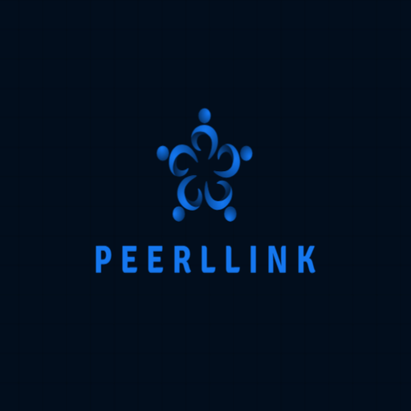

<!-- Project Logo -->

  

<h1 align="center">Peerllink 🌐</h1>

  🔗 Seamless Peer-to-Peer Connectivity | 🚀 Modern Web App | 💻 PWA Ready

  
  
  
  

---

## 🚀 Features

✅ **Modern responsive UI**  
✅ **Peer-to-peer linking & interactions**  
✅ **Progressive Web App (PWA) ready**  
✅ **Optimized icons for all devices**  
✅ **Clean and professional design**
✅ Runs without Internet,Bluetooth & Wi-Fi.**
---

---

## 📲 Connect with me

---

